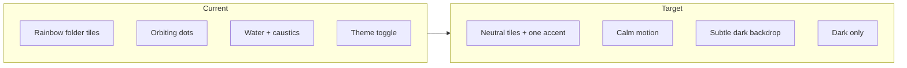

# Dark-only portfolio redesign

## Goals

- **One visual system**: dark background, neutral surfaces, **one accent** (keep emerald/teal as brand tie-in or switch to a single zinc + emerald thread—your current chrome already signals that).
- **Breathing room**: larger section padding, grid gaps, and vertical rhythm; avoid cramped `flex-wrap` category rows on narrow screens.
- **Less noise**: remove rainbow per-category gradients, orbiting “decoration” dots, and the busy animated water layer—or replace with a **subtle** static/slow gradient.
- **Drop theme complexity**: dark only; no toggle, no `ThemeProvider`, no `dark:` variant sprawl.

## 1. Remove light mode and theme plumbing

- **[`src/main.jsx`](src/main.jsx)**: Remove `ThemeProvider` wrapper; render `App` directly.
- **Delete or gut** [`src/context/ThemeContext.jsx`](src/context/ThemeContext.jsx) if nothing imports it after cleanup.
- **[`src/components/BrowserNav.jsx`](src/components/BrowserNav.jsx)**: Remove Sun/Moon toggle block and all `useTheme` usage. Simplify `NavButton` to fixed contrast (e.g. `text-white/90` on the green bar) since the bar stays branded.
- **[`src/App.jsx`](src/App.jsx)**: Replace `useTheme()` with nothing. Root container becomes explicit dark-only classes, e.g. `min-h-screen bg-zinc-950 text-zinc-100` (no `bg-blue-50` / no `dark:` pairs).
- **Optional**: Set `<html class="dark">` in [`index.html`](index.html) only if you still want Tailwind `dark:` for third-party patterns; **prefer removing `dark:` entirely** from components for clarity.

## 2. Global background (replace “too many colors”)

- **[`src/components/WaterBackground.jsx`](src/components/WaterBackground.jsx)** + **[`src/index.css`](src/index.css)**:
  - Replace `.water-bg` purple/indigo base and loud radial blues with a **deep neutral gradient** (e.g. zinc-950 → zinc-900) and **very low-opacity** radial highlights—or remove SVG caustics if it still feels busy.
  - Keep motion **minimal** (slow drift or static).

## 3. Category navigation (Shelf + Folder)

- **[`src/components/Shelf.jsx`](src/components/Shelf.jsx)**:
  - Increase padding (`p-4 md:p-8`), use a calmer panel: `bg-zinc-900/60 border border-white/5` (or similar) instead of generic `.glass` that fought light/dark.
  - **Mobile**: use `overflow-x-auto` + `snap-x` + `scrollbar-none` (or thin scrollbar) with `gap-4` so five categories stay **one horizontal row** instead of a broken 4+1 wrap.

- **[`src/components/Folder.jsx`](src/components/Folder.jsx)**:
  - Remove rotating ring and **multi-color orbiting dots** (biggest “clutter” signal).
  - Replace `bg-gradient-to-br ${folder.color}` tiles with **neutral tiles** (`bg-zinc-800`, `border border-white/10`); **active** state uses accent: `ring-1 ring-emerald-400/50` + slightly lifted background (`bg-zinc-800/90`) or bottom border—**one color**, not five.
  - Tone down hover (`whileHover`) from aggressive `-8px` to `-2px` or use CSS `transition` only.

- **[`src/data/portfolioData.js`](src/data/portfolioData.js)**:
  - Either **remove** `color` fields or repurpose to a single shared accent class string used only for a thin progress underline in [`PortfolioGrid.jsx`](src/components/PortfolioGrid.jsx) (e.g. always `from-emerald-400 to-teal-500`).
  - **Small bugfix while touching data**: `icon: 'talking-head'` does not match [`Folder.jsx`](src/components/Folder.jsx) `iconMap` key `talking`—align keys so Talking Head doesn’t silently fall back to `Film`.

## 4. Profile header

- **[`src/components/ProfileWidget.jsx`](src/components/ProfileWidget.jsx)**:
  - Remove perpetual avatar **wobble** and the “online” dot if it reads as gimmicky (optional).
  - Reflow for mobile: **show social icons** on small screens (currently `hidden md:flex`), perhaps as a compact row with `gap-3`.
  - Replace `dark:` classes with zinc scale only.

## 5. Portfolio grid

- **[`src/components/PortfolioGrid.jsx`](src/components/PortfolioGrid.jsx)**:
  - Increase outer padding and `gap` (`gap-3 md:gap-6`), slightly larger typography for section title.
  - Section accent: **single** vertical bar color (shared accent), not per-category rainbow from `content.color` if you unify data.

## 6. Tailwind / CSS cleanup

- **[`tailwind.config.js`](tailwind.config.js)**: `darkMode: 'class'` becomes unnecessary if you drop `dark:` variants; you can remove the key for simplicity.
- **[`src/index.css`](src/index.css)**: Trim `.glass` / `.dark .glass` split if panels use Tailwind utilities only; keep scrollbar styling but tune for dark.

## Design direction (what “more creative” means here)

Without adding new color chaos: **editorial layout**—strong type scale, generous margins, restrained borders, one accent line, subtle depth. Creativity comes from **composition and typography**, not from five gradients + particles.

## Verification

- Resize to **375px** width: categories scroll horizontally; no overlapping labels; tap targets still comfortable.
- No references to `useTheme` / `ThemeProvider` left.
- Visual check: **≤2 hues** in chrome (green bar optional) + **neutrals** + **one accent** for selection and highlights.
